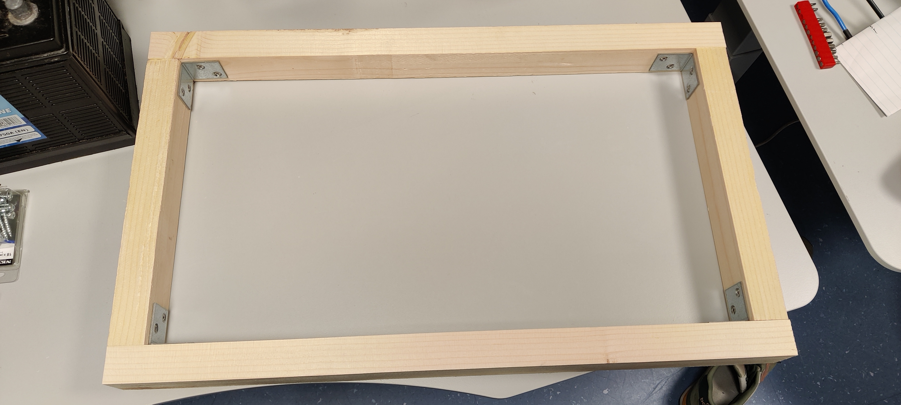
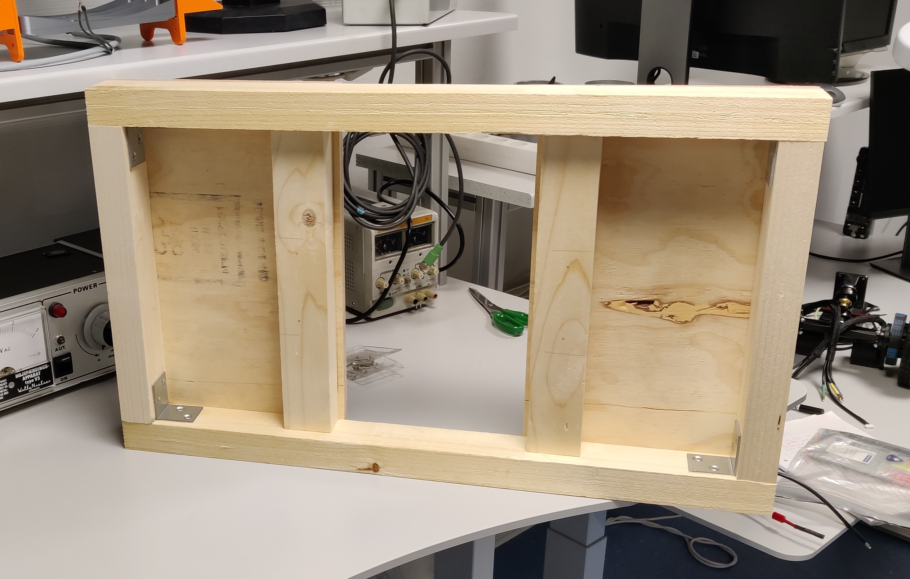
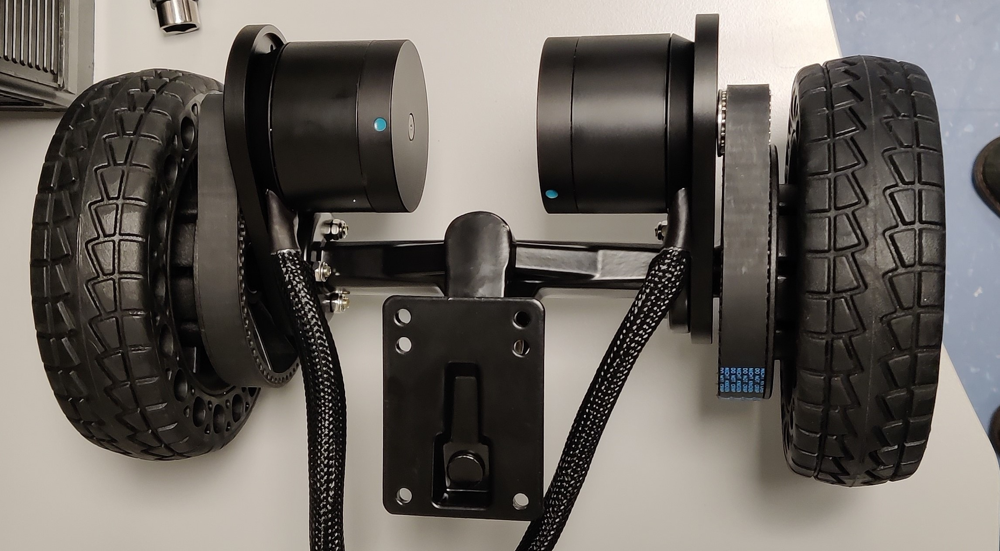
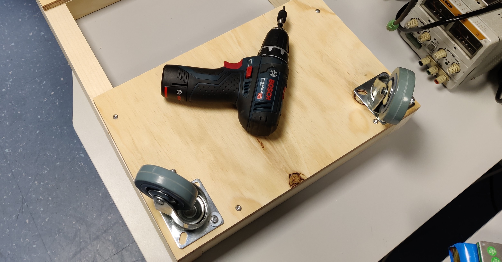
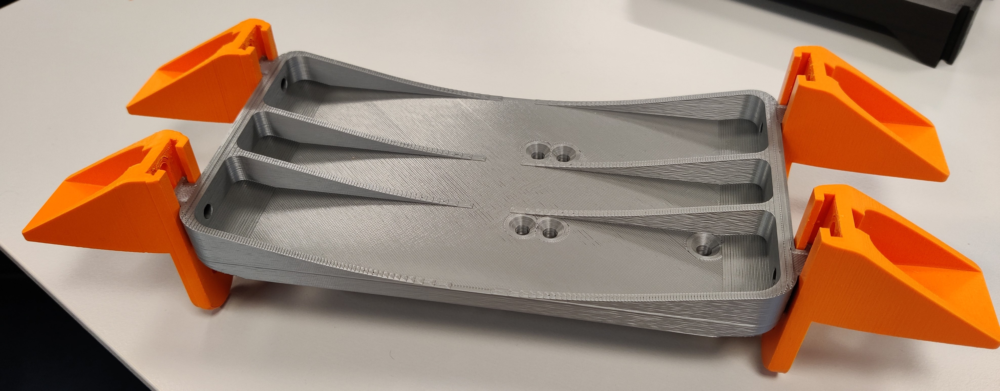
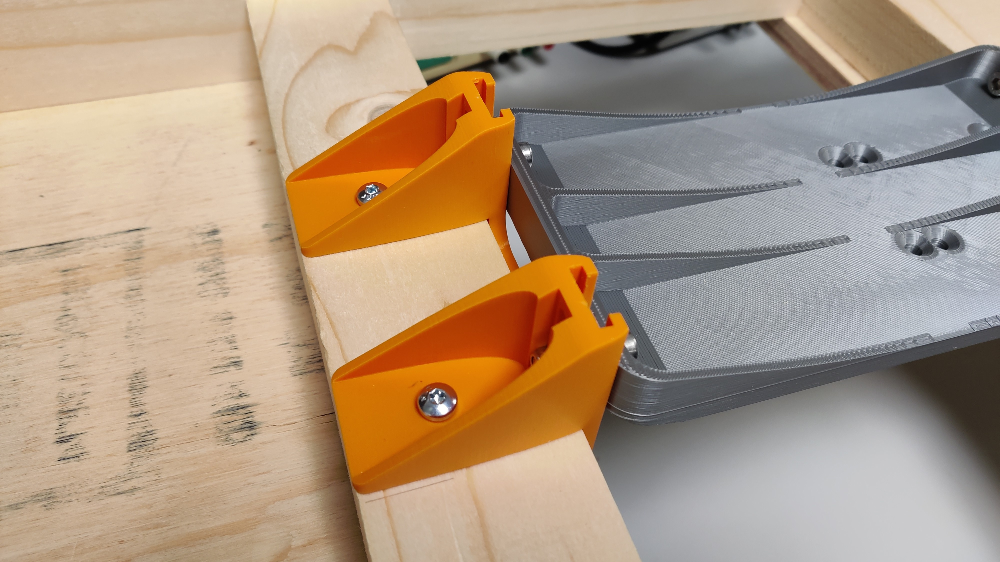
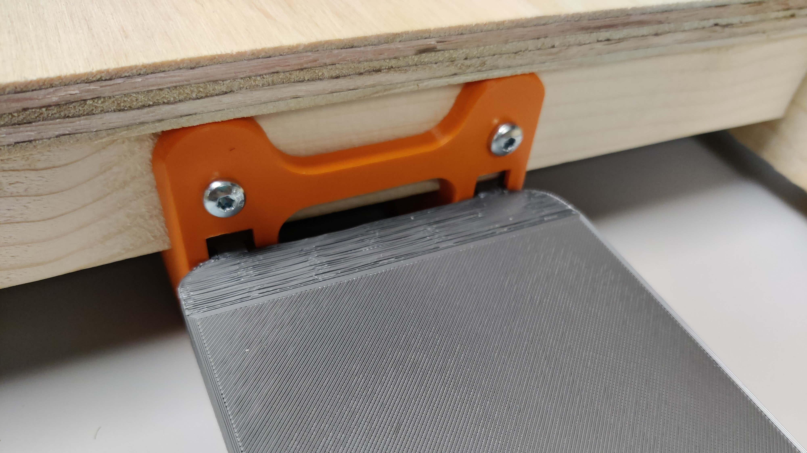
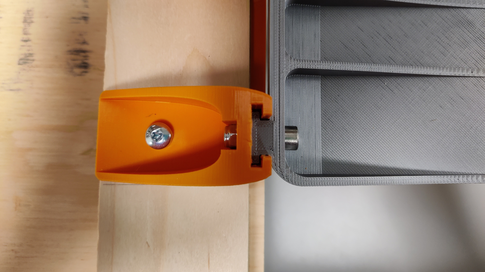
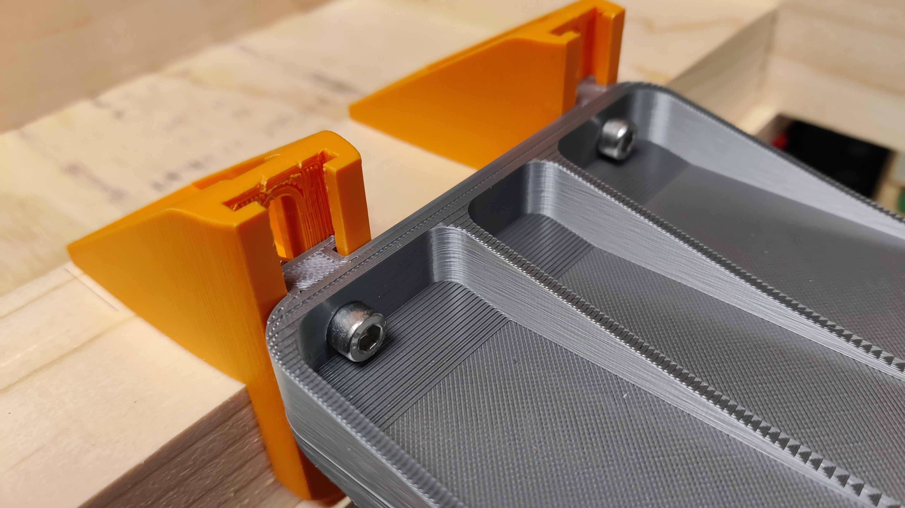

# Steps to Assemble
Listed below are the steps taken to assemble the robot from scratch. Do note that this is a prototype robots and precision materials aren't used. However, measures have been taken to overcome these imperfections.

<!-- TODO: finalise links by including section anchor for all components -->

## Frame
1. Saw the [laths](../components/components.md) to length.
2. Using [angle brackets](../components/components.md) and the 4 frame pieces, assemble the frame.

1. Saw the [board](../components/components.md) to size.
2. With [screws](../components/components.md) attach the board as flooring to the frame.
3. Insert the frame stiffeners, also serving as mounting points for the drivetrain assembly. **Note: Do not fasten these to the frame until the [Drivetrain Mount](#drivetrain-mount) has been printed. This way you can make sure the spacing isn't slightly off.**

---
## Drivetrain
1. First attach the motor bracket to the axle. *Make sure to have the bracket pointing upwards, such that the motor is mounted far from the ground.*
2. Attach the pinion pulley to the motor with the grub screw.
3. Now you can attach the motor to the bracket loosely, such that the belt can be tensioned later. *Beware of the cables, make sure they point across the axle.*
4. Attached each wheel pulley to the the side of the wheels where the spokes are not chamfered, but just straight and rounded. *This might require light force.*
5. Make sure to have the belt on the axle before sliding the wheel on.
6. Slide the wheel and pulley assembly onto the axle with the pulley on the inside.
7. The belt can now be tensioned by fastening the motor in the right spot. *It might be easier to take just the wheel off to be able to tension all the screws properly.*
8. Repeat mirrored for the other side.

---
# Casters
1. In each corner of the of the robot body, a caster wheel can be attached. *We used 2 screws and washers for each caster. Both screws in a spot where they hit the lath frame, diagonally across from each other.*

---
## Drivetrain Mount
With the custom designed [3D printed parts](), we can attach the drivetrain to the frame, and fine-tune the ride-height of the wheels to optimise grip later. The custom mount requires 3 pieces, a mounting rail piece for each side and the middle carriage.

1. The 3 pieces can be printed in PLA with a layer height of 0.2mm, 4 perimeters, and 25% infill to ensure they will be strong enough. ***We also used organic supports, introduced in PrusaSlicer 2.6, which were much easier to remove and resulted in a cleaner print.** (You might be able to find more optimal settings, however these settings were used on a Prusa i3 MK3S and worked for us.)*
2. The prints should now fit together somewhat loosely as shown below.

3. By mock-fitting the mount assembly to the lath stiffeners, you can now make sure the spacing is correct, and fasten the stiffeners to the flooring with a couple screws from below.

4. Fasten the rail pieces to the lath stiffeners on the inside of the frame with 4 screws each. *Make sure they are in the middle of the frame.*
5. The carriage piece can now me fastened to the rails with 4 M5 bolts and lock nuts. *The rails are designed such that the M5 nuts with fit into the channel without rotating.*

|  |  |
| :----------------------------------: | :----------------------------------: |
|  |  |

---
# Attaching the Drivetrain
1. Attach the drivetrain assembly onto the mount with the 6 M5 bolts and lock nuts that came with the [Flipsky truck](../components/components.md).
2. At this point you can loosen the carriage slightly from the rails, and adjust the height of the wheels to ensure proper grip.

<!-- TODO: Add picture of assembly at this point -->